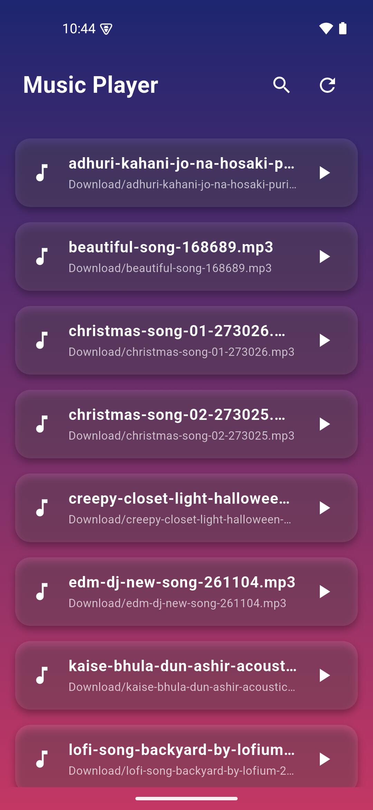
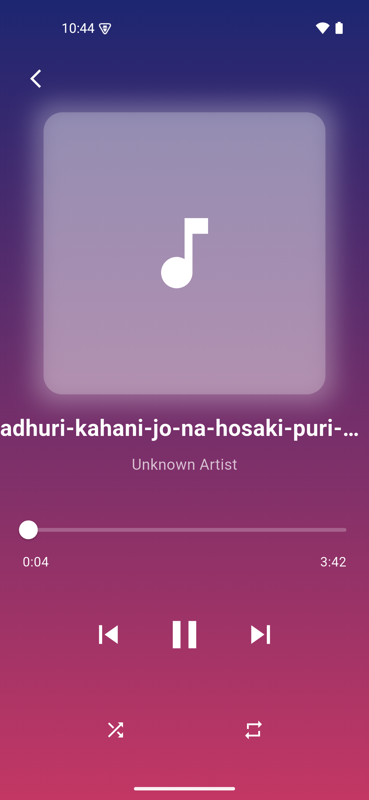

# Music Player APP

This is a simple Flutter Application that allows users to play audio tracks from local storage. The app supports background playback and provides controls for play, pause, skip, and seek operations. 

## Features

- Play, pause, skip, and seek audio tracks.
- Support for background playback.
- Shuffle and repeat modes.
- Displays current song information.

## Screenshots



## Installation

### Prerequisites

- Flutter SDK (latest stable version recommended)
- Dart SDK
- Android Studio or Visual Studio Code (optional, for development)

### Steps

1. Clone the repository:
   ```bash
   git clone <repository-url>
   cd <repository-directory>
   ```

2. Install dependencies:
   ```bash
   flutter pub get
   ```

3. Run the application:
   ```bash
   flutter run
   ```


## Permissions

The app requires music and audio files permissions to read local files. If the permission is not granted, the app will prompt the user to allow permission.

**Required Permissions**:

- **Music and Audio Permission**: To read the local music and audio files.

For Android, ensure that the following permissions are added in the `AndroidManifest.xml`:

```xml
 <uses-permission android:name="android.permission.READ_MEDIA_AUDIO"/>
```


## Packages Used

- `flutter`: The Flutter framework for building the app.
- `just_audio`: A Flutter package to play audio files.
- `audio_service`: A package to create background audio services.

## Installation
To install the app on your Android device:
1. Download the latest APK from the [Releases](https://github.com/santoshvandari/MusicPlayer/releases) section.
2. Transfer the APK to your phone and install it.

## Contributing
We welcome contributions! Feel free to submit a pull request or open an issue if you find bugs or want to add new features. Check out the [Contributing Guidelines](CONTRIBUTING.md) for more information.

## License
This project is licensed under the MIT License. See the [LICENSE](LICENSE) file for details.

## Contact
For any inquiries or support, please reach out at:
- **GitHub**: [@santoshvandari](https://github.com/santoshvandari)

---

### If you like this project, don't forget to give it a ⭐ and share it with others!

### Made By Santosh Bhandar❤️ 

### Keep Coding Keep Smiling